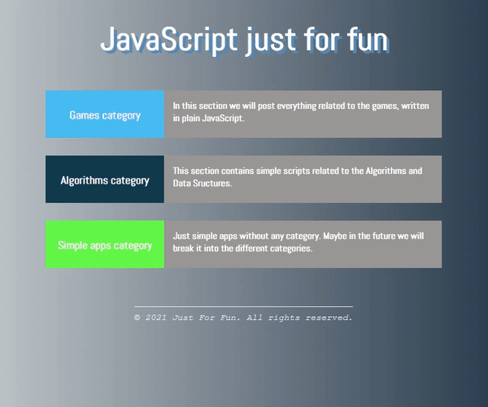

# JavaScript Just For Fun

Mini web applications and scripts just for fun, separated by category such as **games**, **algorithms**, **simple apps**, etc.

## Application dashboard

Just a shell for all scripts.

## Category items

:one: Game category

- **Catch them all** -> _in progress_ :triangular_flag_on_post:
- **Guess the word** -> _in progress_ :triangular_flag_on_post:
- **Simple snake** -> _in progress_ :triangular_flag_on_post:

:two: Algorithms and Data Structure category

- **Factorial example** -> _done_ :white_check_mark:
- **Fibonacci sequence** -> _done_ :white_check_mark:
- **The first three max numbers** -> _done_ :white_check_mark:
- **Fizz Buzz** -> _done_ :white_check_mark:
- **The number is even** -> _done_ :white_check_mark:
- **Power of two** -> _done_ :white_check_mark:
- **Primality check** -> _done_ :white_check_mark:
- **Reverse string** -> _done_ :white_check_mark:

:three: Simple applications category

- **Chuck Norris jokes** -> _done_ :white_check_mark:
- **Expandable cards** -> _done_ :white_check_mark:
- **Github profile info** -> _done_ :white_check_mark:
- **Hoverboard** -> _done_ :white_check_mark:
- **Motivation quotes** -> _done_ :white_check_mark:
- **Parallax scrolling** -> _done_ :white_check_mark:
- **Pokemon cards** -> _done_ :white_check_mark:
- **Progress steps** -> _done_ :white_check_mark:
- **Search toggle bar** -> _done_ :white_check_mark:
- **Simple quiz** -> _in progress_ :triangular_flag_on_post:
- **The matrix** -> _in progress_ :triangular_flag_on_post:
- **Todo list** -> _done_ :white_check_mark:
- **User filter** -> _done_ :white_check_mark:
